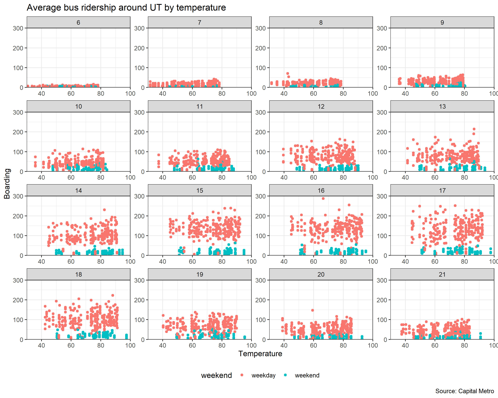

```{r setup, include=FALSE}
knitr::opts_chunk$set(echo = FALSE)
knitr::opts_chunk$set(warning = FALSE)
knitr::opts_chunk$set(message = FALSE)

library(mosaic)
library(tidyverse)
library(rsample)
library(ggplot2)
library(modelr)
library(parallel)
library(foreach)
library(FNN)
library(caret)
library(readr)
library(stargazer)

```

## Problem 1: visualization

```{r}
library(lubridate)

capmetro_UT= read_csv("capmetro_UT.csv")
capmetro_UT = mutate(capmetro_UT,
               day_of_week = factor(day_of_week,
                 levels=c("Mon", "Tue", "Wed","Thu", "Fri", "Sat", "Sun")),
               month = factor(month,
                 levels=c("Sep", "Oct","Nov")))

capmetro_average<- capmetro_UT %>% group_by(hour_of_day, day_of_week, month) %>% summarise(avg_board= mean(boarding))

ggplot(capmetro_average, aes(x= hour_of_day, y= avg_board, group= month, colour= month))+
  geom_line()+
  facet_wrap(~day_of_week)+ labs(x= "hour of day", y= "Average boarding", title = "Average boarding of Capital Metro by hour, month and day")+ theme_bw()
```

We see that the peak hours look fairly consistent across week days usually around 4-5pm. This makes sense as this is when most people would be leaving work. Average boardings in September look lower probably because of the labor day holiday on the first Monday of September. Average boardings on Weds/Thurs/Fri on November look lower probably because of the colder weather.


```{r, fig.width= 10, fig.height= 12}
plot<-capmetro_UT %>%
    group_by(timestamp, hour_of_day) %>%
    mutate(avg_boarding = mean(boarding)) %>%
    ggplot() +
    geom_point(aes(x = temperature, y = avg_boarding, color = weekend)) +
    scale_x_continuous(expand = c(0,0), limits = c(30, 100), 
                       breaks = seq(40, 100, 20)) +
    scale_y_continuous(expand = c(0,0), limits = c(0, 300)) +
    facet_wrap(. ~ hour_of_day, scales = "free") +  
    labs(x = "Temperature", y = "Boarding",
         title = "Average bus ridership around UT by temperature",
         caption = "Source: Capital Metro") + 
    theme_bw()+
  theme(legend.position="bottom")

ggsave("cap_plot.png", width = 10, #long width
        height =8)


```





There doesn't seem to be a particularly noticeable effect of temperatures on ridership holding hour of the day and weekend status. Ridership looks to be "fairly" constant across temperatures.

\newpage

## Problem 2: Saratoga house prices
    
```{r}
data("SaratogaHouses")


rmse_out_2= foreach(i=1:20, .combine='c') %do% {
saratoga_split =  initial_split(SaratogaHouses, prop=0.8)
saratoga_train = training(saratoga_split)
saratoga_test  = testing(saratoga_split)

lm2 = lm(price ~ lotSize + age + livingArea + pctCollege + bedrooms + 
    fireplaces + bathrooms + rooms + heating + fuel + centralAir, data=saratoga_train)
modelr::rmse(lm2, saratoga_test)

}


##manual RMSE function because I use logs here
RMSE <- function(model, dataset) {
  pred_price <- exp(predict(model, dataset))
  resids <- dataset$price - pred_price
  rmse <- sqrt(mean(resids^2)) 
  rmse
}


rmse_out_final_2= foreach(i=1:20, .combine='c') %do% {
saratoga_split =  initial_split(SaratogaHouses, prop=0.8)
saratoga_train = training(saratoga_split)
saratoga_test  = testing(saratoga_split)
  
# Fit to the training data
lm_final_2 = lm(log(price) ~ log(livingArea) + log(lotSize + 1) + log(age + 1) +  log(landValue)+ bathrooms + bedrooms + rooms + heating + fuel + centralAir + fireplaces + newConstruction + waterfront,                         data=saratoga_train)
RMSE(lm_final_2, saratoga_test)

}


df <- data.frame(model=c("baseline", "best"),
                RMSE=c(mean(rmse_out_2), mean(rmse_out_final_2)))


```


We want to build a predictive model of house prices using data on a number of features about homes such as the number of bedrooms, the number of bathrooms, whether there's a fireplace etc. We do this prediction in two ways. The first using a linear model and the second using a K nearest neighbors model. 

I build my "best" linear model and compare it to a baseline linear model. The best model is evaluated using the out of sample root mean squared error. My best model is as follows:

```{r}
print(lm_final_2$call[[2]])
```

The baseline linear model is as follows:

```{r}
print(lm2$call[[2]])
```

As one can see, the main difference between my model and the baseline model are the log transformations and a few additional features including the land value and whether the home is a new construction. The log transformations achieve two things. They allow us to think of the relationship between numeric variables in terms of elasticities i.e. a 1\% increase in independent variable x leads to a $\beta\%$ increase in dependent variable y where $\beta$ is the coefficient on the independent variable. For examplem a 1% increase in the land value increases the price by 2% Log transformations also allow us to standardize the variables and reduce the influence of outliers. We compare the two models below and we see that the model using logs significantly outperforms using the model using the raw variables.


```{r}
print(df)

```

We see that our "best" model has a slightly lower RMSE than the baseline model. Now we compare our "best" linear model to a model using K nearest neighbors with the same covariates. We use K that has the lowest average RMSE.

```{r}
k_grid = seq(3, 51, by=2)


rmse_knn_out = foreach(i=1:10, .combine='rbind') %dopar% {
  saratoga_split =  initial_split(SaratogaHouses, prop=0.8)
  saratoga_train = training(saratoga_split)
  saratoga_test  = testing(saratoga_split)
  this_rmse = foreach(k = k_grid, .combine='c') %do% {
    # train the model and calculate RMSE on the test set
    knn_model = knnreg(log(price) ~ log(livingArea) + log(lotSize + 1) + log(age + 1) +  log(landValue)+ bathrooms + bedrooms + rooms + heating + fuel + centralAir + fireplaces + newConstruction, data=saratoga_train, k = k, use.all=TRUE)
    RMSE(knn_model, saratoga_test)
  }
  data.frame(k=k_grid, rmse=this_rmse)
}
rmse_knn_out = arrange(rmse_knn_out, k)

rmse_avg_grid<-rmse_knn_out %>% group_by(k) %>% summarise(avg_rmse= mean(rmse))
best_k= which.min(rmse_avg_grid$avg_rmse)

```


```{r}
rmse_vec= c(round(df$RMSE[2], 2), round(rmse_avg_grid[best_k,]$avg_rmse, 2))

print(paste("The RMSE from the linear model is ", rmse_vec[1], " while the RMSE from the KNN model is ", rmse_vec[2]), quote= F)

if (rmse_vec[1] > rmse_vec[2]) {
print("The KNN model performs better", quote= F)
} else {
print("The linear model performs better", quote= F)
}

```


\newpage

## Problem 3: German credit

```{r}
german_credit<- read_csv("german_credit.csv")
german_credit_avg<- german_credit %>% group_by(history) %>% summarize(avg_default= mean(Default))


ggplot(data =  german_credit_avg, aes(x= history, y= avg_default))+
  geom_col()+ labs(y= "average default probability", title= "Average default probability by credit history")+ theme_bw()
```
```{r}
credit_glm<-glm(Default ~ duration + amount + installment + age + history + purpose + foreign, family = "binomial", data = german_credit)
coef(credit_glm) %>% round(5)
```

From the bar plot, we see that people with poor or terrible credit history have lower average default rates. Similarly, in the regression we find the same thing where having a poor or terrible history reduces the probability of default. There is probably a selection bias problem with this dataset. About 91% of the data are people with poor/terrible history . An important assumption for linear regression is random sampling of observations and this applies to the logistic regression as well. Also, given that the data is generated with a retrospective case control, there are likely issues with the timing because defaulting affects your credit history 

Also, there are issues of confounding. People with terrible/poor histories are less likely going to get a loan in the first place and even if they can, it would usually be in small amounts making defaults less likely.No I don't think this dataset is suitable for building a predictive model of defaults. If a random sample with present data would not be feasible then it might be helpful to consider using an instrumental variables approach  

\newpage

## Problem 4
We want to build a predictive model of whether an hotel booking has children on it or not. We test three models to start out:

1. baseline 1: a small model that uses only the `market_segment`, `adults`, `customer_type`, and `is_repeated_guest` variables as features.  

2. baseline 2: a big model that uses all the possible predictors _except_ the `arrival_date` variable (main effects only).  

3. the "best" linear model which I construct using all the possible predictors including features derived from timestap such as the day, month and year and we rescale some variables such as the average daily rate and the lead time which have large variation. We also include the squared of the number of special requests.

```{r}
hotel_devs<-read_csv("hotels_dev.csv")


hotel_devs$month<- lubridate::month(hotel_devs$arrival_date, label= TRUE)
hotel_devs$year<-  lubridate::year(hotel_devs$arrival_date)
hotel_devs$day<-   lubridate::wday(hotel_devs$arrival_date, label= T)
hotel_devs$is_weekend<- ifelse(hotel_devs$day == "Sun" | hotel_devs$day == "Sat", 1, 0)
hotel_devs$is_weekday<- ifelse(hotel_devs$is_weekend== 0, 1, 0)
hotel_devs <- hotel_devs %>% mutate_at(c("average_daily_rate", "lead_time"), ~(scale(.) %>% as.vector))
hotel_devs$request_sq= (hotel_devs$total_of_special_requests)^2


hotel_split<- initial_split(hotel_devs, prop= 0.8)
hotel_train<- training(hotel_split)
hotel_test<- testing(hotel_split)

baseline_1<-glm(children ~ market_segment + adults + customer_type, data=hotel_train, family = "binomial")
baseline_2<- glm(children ~ . - arrival_date - month - year - day - is_weekend - is_weekday,  data = hotel_train, family = "binomial")

baseline_3<- glm(children ~ . -arrival_date - is_weekday -is_weekend, data = hotel_train, family= "binomial")


phat_test_hotel1 = predict(baseline_1, hotel_test, type = "response")
yhat_test_hotel1 = ifelse(phat_test_hotel1 > 0.5, 1, 0)
confusion_out_1 = table(y = hotel_test$children, yhat = yhat_test_hotel1)


phat_test_hotel2 = predict(baseline_2, hotel_test, type = "response")
yhat_test_hotel2 = ifelse(phat_test_hotel2 > 0.5, 1, 0)
confusion_out_2 = table(y = hotel_test$children, yhat = yhat_test_hotel2)


phat_test_hotel3 = predict(baseline_3, hotel_test, type = "response")
yhat_test_hotel3 = ifelse(phat_test_hotel3 > 0.5, 1, 0)
confusion_out_3 = table(y = hotel_test$children, yhat = yhat_test_hotel3)

```

We use the out-of-sample accuracy as a measure of the quality of the model. We use a threshold of 0.5

We see the confusion matrix below for the baseline model below

```{r}
confusion_out_1
acc<-round(sum(diag(confusion_out_1)/sum(confusion_out_1))*100, 2)
print(paste("This model has an out of sample accuracy of ", acc, "%"), quote= F)
```

We see the confusion matrix below for the big model below

```{r}
confusion_out_2
acc<-round(sum(diag(confusion_out_2)/sum(confusion_out_2))*100,2)
print(paste("This model has an out of sample accuracy of ", acc, "%"), quote= F)
```

We see the confusion matrix below for the "best" model below

```{r}
confusion_out_3
acc<-round(sum(diag(confusion_out_3)/sum(confusion_out_3))*100, 2)
print(paste("This model has an out of sample accuracy of ", acc, "%"), quote= F)
```

As we see, even though it's not by a large gap, the "best" model with the additional time-stamp features has the highest out of sample accuracy. We then use this "best" model on a different hotel dataset. The plot below shows the ROC curve using the model on the new hotel dataset

```{r, eval= T}
hotel_val<-read_csv("hotels_val.csv")

hotel_val$month<- lubridate::month(hotel_val$arrival_date, label= TRUE)
hotel_val$year<-  lubridate::year(hotel_val$arrival_date)
hotel_val$day<-   lubridate::wday(hotel_val$arrival_date, label= T)
hotel_val$is_weekend<- ifelse(hotel_val$day == "Sun" | hotel_val$day == "Sat", 1, 0)
hotel_val$is_weekday<- ifelse(hotel_val$is_weekend== 0, 1, 0)
hotel_val <- hotel_val %>% mutate_at(c("average_daily_rate", "lead_time"), ~(scale(.) %>% as.vector))
hotel_val$request_sq= (hotel_val$total_of_special_requests)^2

best_logit_hotel<- glm(children ~ . -arrival_date - is_weekday -is_weekend, data = hotel_val, family= "binomial")


```


```{r, eval= T}
library(foreach)
phat_test_logit_hotel = predict(best_logit_hotel, hotel_val, type='response')

thresh_grid = seq(0.95, 0.05, by=-0.005)
roc_curve_spam = foreach(thresh = thresh_grid, .combine='rbind') %do% {
  yhat_test_logit_hotel = ifelse(phat_test_logit_hotel >= thresh, 1, 0)

  # FPR, TPR for linear model
  confusion_out_logit = table(y =  hotel_val$children, yhat = yhat_test_logit_hotel)
  out_logit = data.frame(model = "logit",
                       TPR = confusion_out_logit[2,2]/sum(hotel_val$children==1),
                       FPR = confusion_out_logit[1,2]/sum(hotel_val$children==0))
  
  out_logit
} %>% as.data.frame()

ggplot(roc_curve_spam) + 
  geom_line(aes(x=FPR, y=TPR)) + 
  labs(title="ROC curves: logit model") +
  theme_bw(base_size = 10)
```


```{r, eval= T}
N = nrow(hotel_val)
K = 20
fold_id = rep_len(1:K, N)  # repeats 1:K over and over again
fold_id = sample(fold_id, replace=FALSE) 


predict_save<-data.frame(matrix(ncol=3,nrow=20, dimnames=list(NULL, c("fold", "predicted", "actual"))))


for(i in 1:K) {
  train_set = which(fold_id != i)
  y_test = hotel_val[-train_set, ]
    best_logit_hotel= glm(children ~ ., data=hotel_val[train_set , !(names(hotel_val) %in% c('deposit_type', "arrival_date", "is_weekend", "is_weekday"))], family="binomial")
    yhat_test = predict(best_logit_hotel, newdata=hotel_val[-train_set,], type = "response")
    predict_save$fold[i]<- i
    predict_save$predicted[i]<- sum(yhat_test)
    predict_save$actual[i]<- sum(hotel_val[-train_set,]$children)
}


predict_save$error= sqrt(((predict_save$actual - predict_save$predicted)^2))


ggplot(data = predict_save, aes(x= factor(fold), y= error))+
  geom_bar(stat = "identity")+
  labs(x= "fold", y= "Error", title = "Fold vs Error")+theme_bw()


```
The graph above shows the error from prediction which is the absolute value of the difference between the actual total number of children in each fold and the sum of the predicted probabilities for that fold.

```{r}
error<-round(mean(predict_save$error), 2)
print(paste("The average prediction error is ", error), quote= F)
```


