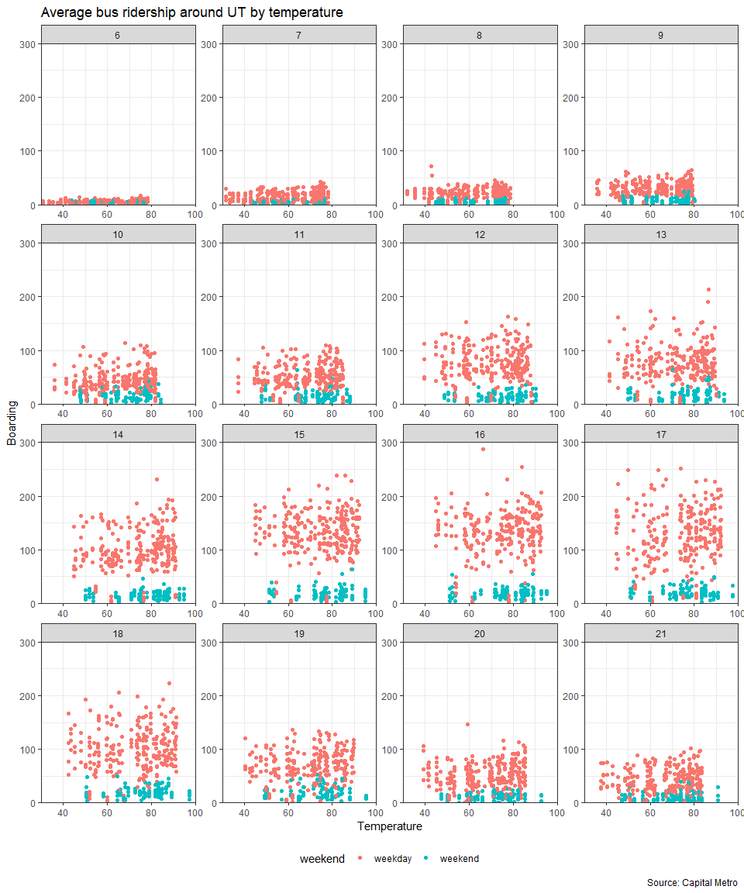
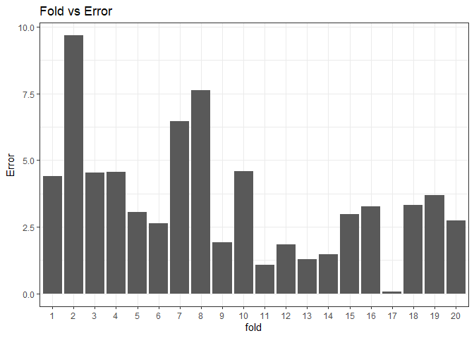

Problem 1: visualization
------------------------

We see that the peak hours look fairly consistent across week days
usually around 4-5pm. This makes sense as this is when most people would
be leaving work. Average boardings in September look lower probably
because of the labor day holiday on the first Monday of September.
Average boardings on Weds/Thurs/Fri on November look lower probably
because of the colder weather.

There doesn’t seem to be a particularly noticeable effect of
temperatures on ridership holding hour of the day and weekend status.
Ridership looks to be “fairly” constant across temperatures.

Problem 2: Saratoga house prices
--------------------------------

We want to build a predictive model of house prices using data on a
number of features about homes such as the number of bedrooms, the
number of bathrooms, whether there’s a fireplace etc. We do this
prediction in two ways. The first using a linear model and the second
using a K nearest neighbors model.

I build my “best” linear model and compare it to a baseline linear
model. The best model is evaluated using the out of sample root mean
squared error. My best model is as follows:

    ## log(price) ~ log(livingArea) + log(lotSize + 1) + log(age + 1) + 
    ##     log(landValue) + bathrooms + bedrooms + rooms + heating + 
    ##     fuel + centralAir + fireplaces + newConstruction + waterfront

The baseline linear model is as follows:

    ## price ~ lotSize + age + livingArea + pctCollege + bedrooms + 
    ##     fireplaces + bathrooms + rooms + heating + fuel + centralAir

As one can see, the main difference between my model and the baseline
model are the log transformations and a few additional features
including the land value and whether the home is a new construction. The
log transformations achieve two things. They allow us to think of the
relationship between numeric variables in terms of elasticities i.e. a
1% increase in independent variable x leads to a *β*% increase in
dependent variable y where *β* is the coefficient on the independent
variable. For examplem a 1% increase in the land value increases the
price by 2% Log transformations also allow us to standardize the
variables and reduce the influence of outliers. We compare the two
models below and we see that the model using logs significantly
outperforms using the model using the raw variables.

    ##      model     RMSE
    ## 1 baseline 66982.61
    ## 2     best 61525.17

We see that our “best” model has a slightly lower RMSE than the baseline
model. Now we compare our “best” linear model to a model using K nearest
neighbors with the same covariates. We use K that has the lowest average
RMSE.

    ## [1] The RMSE from the linear model is  61525.17  while the RMSE from the KNN model is  65592.92

    ## [1] The linear model performs better

Problem 3: German credit
------------------------

    ##         (Intercept)            duration              amount         installment 
    ##            -0.70753             0.02526             0.00010             0.22160 
    ##                 age         historypoor     historyterrible          purposeedu 
    ##            -0.02018            -1.10759            -1.88467             0.72479 
    ## purposegoods/repair       purposenewcar      purposeusedcar       foreigngerman 
    ##             0.10490             0.85446            -0.79593            -1.26468

From the bar plot, we see that people with poor or terrible credit
history have lower average default rates. Similarly, in the regression
we find the same thing where having a poor or terrible history reduces
the probability of default. There is probably a selection bias problem
with this dataset. About 91% of the data are people with poor/terrible
history . An important assumption for linear regression is random
sampling of observations and this applies to the logistic regression as
well. Also, given that the data is generated with a retrospective case
control, there are likely issues with the timing because defaulting
affects your credit history

Also, there are issues of confounding. People with terrible/poor
histories are less likely going to get a loan in the first place and
even if they can, it would usually be in small amounts making defaults
less likely.No I don’t think this dataset is suitable for building a
predictive model of defaults. If a random sample with present data would
not be feasible then it might be helpful to consider using an
instrumental variables approach

Problem 4
---------

We want to build a predictive model of whether an hotel booking has
children on it or not. We test three models to start out:

1.  baseline 1: a small model that uses only the `market_segment`,
    `adults`, `customer_type`, and `is_repeated_guest` variables as
    features.

2.  baseline 2: a big model that uses all the possible predictors
    *except* the `arrival_date` variable (main effects only).

3.  the “best” linear model which I construct using all the possible
    predictors including features derived from timestap such as the day,
    month and year and we rescale some variables such as the average
    daily rate and the lead time which have large variation. We also
    include the squared of the number of special requests.

We use the out-of-sample accuracy as a measure of the quality of the
model. We use a threshold of 0.5

We see the confusion matrix below for the baseline model below

    ##    yhat
    ## y      0
    ##   0 8313
    ##   1  686

    ## [1] This model has an out of sample accuracy of  92.38 %

We see the confusion matrix below for the big model below

    ##    yhat
    ## y      0    1
    ##   0 8222   91
    ##   1  439  247

    ## [1] This model has an out of sample accuracy of  94.11 %

We see the confusion matrix below for the “best” model below

    ##    yhat
    ## y      0    1
    ##   0 8230   83
    ##   1  437  249

    ## [1] This model has an out of sample accuracy of  94.22 %

As we see, even though it’s not by a large gap, the “best” model with
the additional time-stamp features has the highest out of sample
accuracy. We then use this “best” model on a different hotel dataset.
The plot below shows the ROC curve using the model on the new hotel
dataset

The graph above shows the error from prediction which is the absolute
value of the difference between the actual total number of children in
each fold and the sum of the predicted probabilities for that fold.

    ## [1] The average prediction error is  3.04
