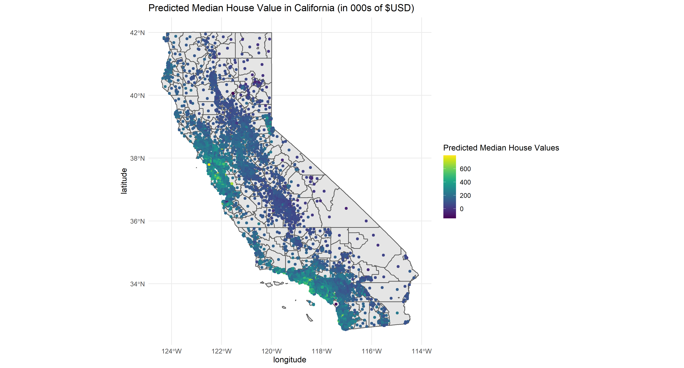

```{r setup, include=FALSE}
knitr::opts_chunk$set(echo = FALSE)
knitr::opts_chunk$set(cache= TRUE)
knitr::opts_chunk$set(message = FALSE)
knitr::opts_chunk$set(warning = FALSE)


library(tidyverse)
library(mosaic)
library(foreach)
library(parallel)
library(FNN)
library(caret)
library(rsample)
library(tidycensus)
library(rgeos)
library(geosphere)
library(sf)
library(ggmap)
library(rgdal)
library(osmdata)
library(tigris)
library(rnaturalearth)  
library(rnaturalearthdata)
library(rnaturalearthhires)
library(viridis)

```

## What causes what

1. We cannot just run a regression of crime on police because high crime cities have an incentive to hire more cops and so we have high crime increasing the number of cops and so we have a reverse causation problem where a high number of cops might reduce crime but a high crime also increases the number of cops.

2. They were able to isolate this effect by analyzing high alert days for terrorism. In Washington,DC, when the city is on high alert for terrorism there are more cops on the streets for reasons unrelated to street crime and so here they are able to isolate the effect of police on crime. They found that crime is lower when there is a larger police presence on high alert days.

3. They control for metro ridership in order to control for potentially less activity generally during high terror alerts. It's quite possible that the high terror alert leads less people to go out generally and when there's less people outdoors, there's going to be less crime.

4. The model being estimated is a linear model with interactions on districts. So they're allowing the effect of the high alert to vary by districts. We see that the fall in crime because of the higher police presence during high terror alerts is mainly being driven by the fall in crime around the first district. The coefficient on the interaction is negative and significant while the coefficient on the high alert interacted with other districts is still negative but not significant.

\newpage


## Predictive model building: green certification 

1) Overview

We want to build a predictive model of rental income, and to use this model to quantify the average change in rental income per square foot associated with green certification.

2) Data and model

We use a data set on green buildings in the United States. It contains data on 7,894 commercial rental properties across the country and of these, 685 properties have been awarded either LEED or EnergyStar certification as a green building. The figure below shows the distribution of revenue by green rating. We see that buildings with a green rating have a slightly higher median revenue than those without but buildings without a green rating have outliers in a higher range.

```{r}
greenbuildings<-read_csv("greenbuildings.csv")
greenbuildings$cluster<- as.factor(greenbuildings$cluster) ##it does not represent a continuous measure
greenbuildings$rental_income= greenbuildings$Rent * greenbuildings$leasing_rate

##needed variables
greenbuildings<- greenbuildings %>% select(-CS_PropertyID)

ggplot(data= greenbuildings)+
  geom_boxplot(aes(x= factor(green_rating), y= rental_income))+
  labs(x= "Green rating?", title= "Distribution of revenue per square foot per calendar year by green rating", y= "Revenue per square foor per calendar year")+
  scale_x_discrete(labels=c("0" = "No", "1" = "Yes"))+theme_minimal()
```


We now turn towards building a predictive model of log _revenue per square foot per calendar_ . Using logs is helpful as it "standardizes" the outcome and we can think of the relationship in terms of percentages. Here we also rescale the size variable as there are also large outliers in this variable. We fit linear regression models in combination with different step selection methods to get the "best" model using the AIC (Akaike Information Criterion)[^1]. We test models using forward selection starting from a null model with no predictor and stepwise selection starting from a baseline model. Both selection types make use of predictors from a baseline model. We choose the baseline predictors by running a simple linear model with all of our predictors except ones that are linear combinations of others (total_dd_07) or our part of our outcome variable (rent and leasing rate). We then use the root mean squared error (rmse) on a test portion of the data as a measure of the performance of these models.


```{r, eval=T, cache= TRUE}

set.seed(1234)
##dropping zeros
greenbuildings<- filter(greenbuildings, rental_income !=0)
greenbuildings= greenbuildings[complete.cases(greenbuildings), ]

##rescaling size variable
greenbuildings$scale_size<- (greenbuildings$size - mean(greenbuildings$size))/sd(greenbuildings$size)

rmse_out_baseline= foreach(i=1:10, .combine='c') %do% {
greenbuildings_split<- initial_split(greenbuildings, prop= 0.8)
greenbuildings_train<- training(greenbuildings_split)
greenbuildings_test<- testing(greenbuildings_split)

baseline_model<- lm(log(rental_income) ~  scale_size + empl_gr + age + stories + renovated + class_a + class_b + green_rating + net + amenities + cd_total_07 + hd_total07 + Precipitation + Gas_Costs + Electricity_Costs+ City_Market_Rent, data= greenbuildings_train)

modelr::rmse(baseline_model, greenbuildings_test)

}

##forward selection
  lm0 = lm(log(rental_income) ~ 1, data=greenbuildings_train)
  lm_forward = step(lm0, direction='forward',
	scope=~(scale_size + empl_gr + age + stories + renovated + class_a + class_b + green_rating + net + amenities + cd_total_07 + hd_total07 + Precipitation + Gas_Costs + Electricity_Costs+ City_Market_Rent)^2, trace = 0)
  
rmse_out_forward= foreach(i=1:10, .combine= "c") %do% {
  
greenbuildings_split<- initial_split(greenbuildings, prop= 0.8)
greenbuildings_train<- training(greenbuildings_split)
greenbuildings_test<- testing(greenbuildings_split)

updated_model<- update(lm_forward, data= greenbuildings_train)
modelr::rmse(updated_model, greenbuildings_test)

}
  

##stepwise selection
lm_step = step(baseline_model, 
scope=~(.)^2, trace = 0)
  
rmse_out_step= foreach(i=1:10, .combine= "c") %do% {
  
greenbuildings_split<- initial_split(greenbuildings, prop= 0.8)
greenbuildings_train<- training(greenbuildings_split)
greenbuildings_test<- testing(greenbuildings_split)

updated_model<- update(lm_step, data= greenbuildings_train)
modelr::rmse(updated_model, greenbuildings_test)

}


```

\newpage

3) Results

The figure below shows the rmse for the different models below. We see that the forward model performs slightly better than the baseline and stepwise and so we use it as our model of choice

```{r}
values<-c(mean(rmse_out_baseline), mean(rmse_out_forward), mean(rmse_out_step))
model_type<- c("baseline","forward", "step")
rmse_df= data.frame(values, model_type)

ggplot(rmse_df, aes(y=values, x=model_type)) + 
    geom_bar(stat="identity")+ labs(y= "RMSE", x= "Model Type")

```


[^1]: https://en.wikipedia.org/wiki/Akaike_information_criterion


The model's formula is as follows:

```{r}
getCall(lm_forward)
```

We see that the green_ratings variable has an interaction present with the amenities variable. To determine the effect of having a green_rating, we use the average value of amenities and do the calculations as follows since we use logarithms

```{r, echo= T}
b2= lm_forward$coefficients["green_rating"]
b3= lm_forward$coefficients["amenities:green_rating"]


total_effect= exp(b2 + b3*mean(greenbuildings$amenities)) 
print(total_effect)
```


4) Conclusion

We set out to build a model that allows us to determine the effect of having a green rating (either LEED or EnergyStar). We used a variety of linear of models and arrived at one using the AIC to first select "appropriate" models and then we compare these models in terms of the prediction error. We arrive at a model that uses forward selection starting from a null model and then considering all possible interactions of baseline predictors. We see that the effect og having a green rating depends on the buildings amenities and that having a green rating increases the rental income by about 13% at an average level of amenities. 

\newpage

## Predictive model building: California housing  

1) Overview

We want to build a predictive model of median house values in California.


2) Data and model 

We use a census-tract level dataset on residential housing in the state. The data contains 20,640 records of median house values along with other features such as . The plot below shows a plot of the median values on a map of California using the coordinates.

We start with a baseline model that fits a simple linear model with all our main features. We standardize the rooms and bedrooms variable by taking their average over households. Next, we perform step selection and fit linear models and select the combination that performs best using the AIC (Akaike Information Criterion). We use two step selection methods, forward and stepwise. Finally, we fit a K nearest neighbors model.

From the figure below houses on the coast look to be more expensive which makes sense. We get the California coastline and take the distance of the houses from the coast and redo the above models with this additional feature. 


```{r}
##loading housing data and census tracts
CAhousing<- read_csv("CAhousing.csv")
CAhousing$avg_rooms<- CAhousing$totalRooms/CAhousing$households
CAhousing$avg_bedrooms<- CAhousing$totalBedrooms/CAhousing$households


ca_tracts<- tracts(state= "CA", cb= TRUE, refresh= TRUE)

main_plot<-ggplot(data= ca_tracts)+
  geom_sf()+
  geom_point(data=CAhousing, aes(x=longitude, y=latitude, color= medianHouseValue))+
  coord_sf()+
scale_color_viridis(option = "D")+
  labs(title= "Median House Value in California (in 000s of $USD)", color= "Median House Values")+ theme_minimal()

ggsave("main_plot.png", width = 12, #long width
        height =8)

```


```{r}

rmse_out_baseline= foreach(i=1:10, .combine='c') %do% {
CAhousing_split<- initial_split(CAhousing, prop= 0.8)
CAhousing_train<- training(CAhousing_split)
CAhousing_test<- testing(CAhousing_split)

baseline_model<- lm(medianHouseValue ~ population + housingMedianAge + medianIncome + avg_rooms + avg_bedrooms, data= CAhousing_train)

modelr::rmse(baseline_model, CAhousing_test)
}


##forward selection
  lm0 = lm(medianHouseValue ~ 1, data=CAhousing_train)
  lm_forward = step(lm0, direction='forward',
	scope=~(population + housingMedianAge + medianIncome + avg_rooms + avg_bedrooms)^2, trace = 0)
  
rmse_out_forward= foreach(i=1:10, .combine= "c") %do% {
  
CAhousing_split<- initial_split(CAhousing, prop= 0.8)
CAhousing_train<- training(CAhousing_split)
CAhousing_test<- testing(CAhousing_split)

updated_model<- update(lm_forward, data= CAhousing_train)
modelr::rmse(updated_model, CAhousing_test)

}
  
  
##stepwise selection
lm_step = step(baseline_model, 
scope=~(.)^2, trace = 0)
  
rmse_out_step= foreach(i=1:10, .combine= "c") %do% {
  
CAhousing_split<- initial_split(CAhousing, prop= 0.8)
CAhousing_train<- training(CAhousing_split)
CAhousing_test<- testing(CAhousing_split)

updated_model<- update(lm_step, data= CAhousing_train)
modelr::rmse(updated_model, CAhousing_test)

}

##knn 

k_grid = seq(3, 51, by=2)


rmse_knn_out = foreach(i=1:10, .combine='rbind') %dopar% {
  CAhousing_split =  initial_split(CAhousing, prop=0.8)
  CAhousing_train = training(CAhousing_split)
  CAhousing_test  = testing(CAhousing_split)
  this_rmse = foreach(k = k_grid, .combine='c') %do% {
    # train the model and calculate RMSE on the test set
    knn_model = knnreg(medianHouseValue ~ population + housingMedianAge + medianIncome + avg_rooms + avg_bedrooms, data=CAhousing_train, k = k, use.all=TRUE)
    modelr::rmse(knn_model, CAhousing_test)
  }
  data.frame(k=k_grid, rmse=this_rmse)
}
rmse_knn_out = arrange(rmse_knn_out, k)

rmse_avg_grid<-rmse_knn_out %>% group_by(k) %>% summarise(avg_rmse= mean(rmse))
best_k= which.min(rmse_avg_grid$avg_rmse)


```


```{r, message=F}

## getting California coast line
osm_box <- getbb (place_name = "California") %>%
  opq(timeout= 70) %>% 
  add_osm_feature("natural", "coastline")
bounds= osm_box$bbox

basemap <- rnaturalearth::ne_countries(scale = 50, country = "united states of america", returnclass = "sf")[1]
basemap_lines <- basemap %>% st_cast("MULTILINESTRING")


ymin <- -32.5295236
xmin <- -124.482003
ymax <-  42.009499
xmax <- -114.1307816


bbox <- st_polygon(list(rbind(c(xmin,ymin), c(xmin,ymax), c(xmax,ymax), c(xmax,ymin),c(xmin,ymin)))) %>% st_sfc()
st_crs(bbox) <- 4326
crop_lines <- st_intersection(basemap_lines, bbox)
plot(crop_lines, main= "California Coastline")

##getting distance from coastline.
CAhousing_sf <- CAhousing %>% st_as_sf(coords = c('longitude','latitude')) 
st_crs(CAhousing_sf)<- 4326

CAhousing_sf$coast_distance<- as.vector(st_distance(crop_lines, CAhousing_sf))


```


```{r}

rmse_out_baseline_coast= foreach(i=1:10, .combine='c') %do% {
CAhousing_sf_split<- initial_split(CAhousing_sf, prop= 0.8)
CAhousing_sf_train<- training(CAhousing_sf_split)
CAhousing_sf_test<- testing(CAhousing_sf_split)

baseline_model_coast<- lm(medianHouseValue ~ population + housingMedianAge + medianIncome + avg_rooms + avg_bedrooms + coast_distance, data= CAhousing_sf_train)

modelr::rmse(baseline_model_coast, CAhousing_sf_test)
}


##forward selection
  lm0 = lm(medianHouseValue ~ 1, data=CAhousing_sf_train)
  lm_forward_coast = step(lm0, direction='forward',
	scope=~(population + housingMedianAge + medianIncome + avg_rooms + avg_bedrooms + coast_distance)^2, trace = 0)
  
rmse_out_forward_coast= foreach(i=1:10, .combine= "c") %do% {
  
CAhousing_sf_split<- initial_split(CAhousing_sf, prop= 0.8)
CAhousing_sf_train<- training(CAhousing_sf_split)
CAhousing_sf_test<- testing(CAhousing_sf_split)

updated_model<- update(lm_forward_coast, data= CAhousing_sf_train)
modelr::rmse(updated_model, CAhousing_sf_test)

}
  
  
##stepwise selection
lm_step_coast = step(baseline_model_coast, 
scope=~(.)^2, trace = 0)
  
rmse_out_step_coast= foreach(i=1:10, .combine= "c") %do% {
  
CAhousing_sf_split<- initial_split(CAhousing_sf, prop= 0.8)
CAhousing_sf_train<- training(CAhousing_sf_split)
CAhousing_sf_test<- testing(CAhousing_sf_split)

updated_model<- update(lm_step_coast, data= CAhousing_sf_train)
modelr::rmse(updated_model, CAhousing_sf_test)

}


##knn

k_grid = seq(3, 51, by=2)

rmse_knn_out_coast = foreach(i=1:10, .combine='rbind') %dopar% {
  CAhousing_sf_split =  initial_split(CAhousing_sf, prop=0.8)
  CAhousing_sf_train = training(CAhousing_sf_split)
  CAhousing_sf_test  = testing(CAhousing_sf_split)
  this_rmse = foreach(k = k_grid, .combine='c') %do% {
    # train the model and calculate RMSE on the test set
    knn_model_coast = knnreg(medianHouseValue ~ population + housingMedianAge + medianIncome + avg_rooms + avg_bedrooms+ coast_distance, data=CAhousing_sf_train, k = k, use.all=TRUE)
    modelr::rmse(knn_model_coast, CAhousing_sf_test)
  }
  data.frame(k=k_grid, rmse=this_rmse)
}
rmse_knn_out_coast = arrange(rmse_knn_out_coast, k)

rmse_avg_grid_coast<-rmse_knn_out_coast %>% group_by(k) %>% summarise(avg_rmse= mean(rmse))
best_k_coast= which.min(rmse_avg_grid_coast$avg_rmse)

```


\newpage

3) Results

The figure below shows the root mean squared error for our different model types. We see that the models with the distance to coast variable perform significantly better for all model types. There is not a large difference in terms of out of sample accuracy between the forward selection model and the stepwise model. We use the stepwise model as our model of choice. 

```{r}
values<-c(mean(rmse_out_baseline_coast), mean(rmse_out_forward_coast), mean(rmse_out_step_coast), rmse_avg_grid_coast[best_k, ]$avg_rmse)
model_type<- c("baseline","forward", "step", "knn")
coast<- rep("coast", 4)

rmse_coast= data.frame(values, model_type, coast)

values<-c(mean(rmse_out_baseline), mean(rmse_out_forward), mean(rmse_out_step), rmse_avg_grid[best_k, ]$avg_rmse)
model_type<- c("baseline","forward", "step", "knn")
coast<- rep("no coast", 4)
rmse_no_coast= data.frame(values, model_type, coast)

rmse_df= rbind(rmse_coast, rmse_no_coast)

ggplot(rmse_df, aes(fill=coast, y=values, x=model_type)) + 
    geom_bar(position="dodge", stat="identity")+ labs(y= "RMSE", x= "Model Type")+
  theme_minimal()

```


```{r}
rmse_best<- mean(rmse_out_step_coast)
print(paste("The model's RMSE is ", rmse_best), quote= F)
```


We then use this model to predict median house values using our original dataset and we get the absolute value of the prediction errors from this model as well. The plot below shows these on a map of California

```{r}
CAhousing_sf$pred<-predict(lm_step_coast, CAhousing_sf)
CAhousing_sf$error<- abs(CAhousing_sf$medianHouseValue - CAhousing_sf$pred)

CAhousing$pred= CAhousing_sf$pred
CAhousing$error= CAhousing_sf$error


plot1<-ggplot(data= ca_tracts)+
  geom_sf()+
  geom_point(data=CAhousing, aes(x=longitude, y=latitude, color= pred/1000))+
  coord_sf()+
  scale_color_viridis(option = "D")+
  theme_minimal()+ labs(title= "Predicted Median House Value in California (in 000s of $USD)", color= "Predicted Median House Values") 
ggsave("pred_plot.png", width = 13, #long width
        height =7)


plot2<-ggplot(data= ca_tracts)+
  geom_sf()+
  geom_point(data=CAhousing, aes(x=longitude, y=latitude, color= error/1000))+
  coord_sf()+
  scale_color_viridis(option = "D")+
  theme_minimal()+ labs(title= "Residuals from Predicted Median House Values in California (in 000s of $USD)", color= "Residuals") 

ggsave("resid_plot.png", width = 13, #long width
        height =7)
```




