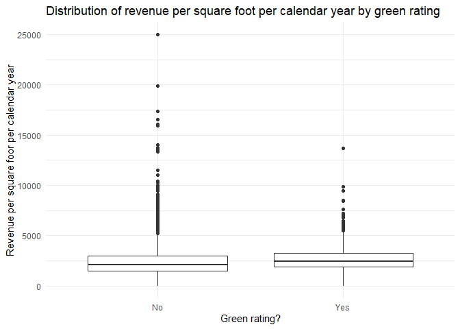
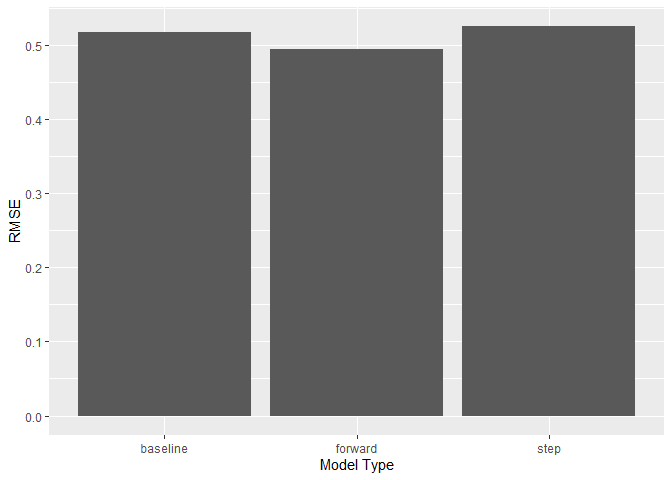
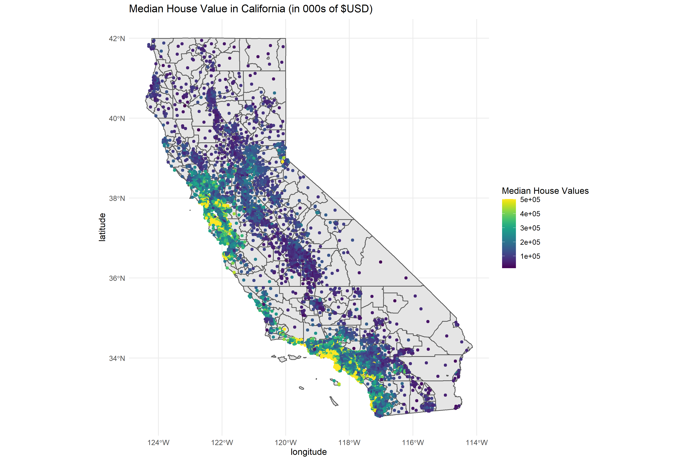
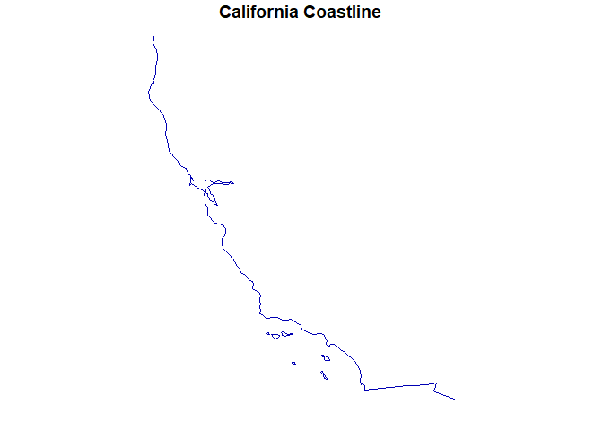
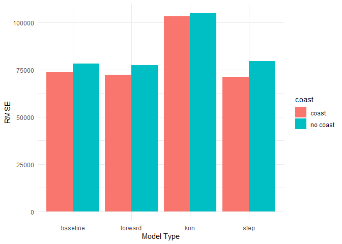
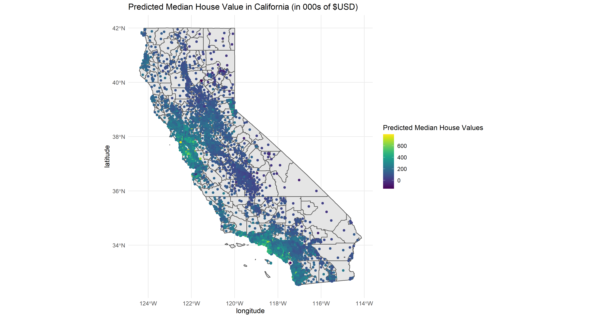
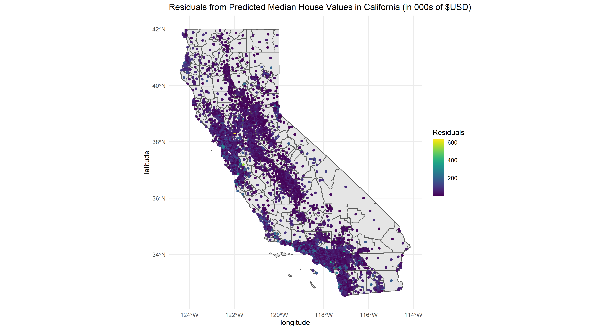

## What causes what

1.  We cannot just run a regression of crime on police because high
    crime cities have an incentive to hire more cops and so we have high
    crime increasing the number of cops and so we have a reverse
    causation problem where a high number of cops might reduce crime but
    a high crime also increases the number of cops.

2.  They were able to isolate this effect by analyzing high alert days
    for terrorism. In Washington,DC, when the city is on high alert for
    terrorism there are more cops on the streets for reasons unrelated
    to street crime and so here they are able to isolate the effect of
    police on crime. They found that crime is lower when there is a
    larger police presence on high alert days.

3.  They control for metro ridership in order to control for potentially
    less activity generally during high terror alerts. It’s quite
    possible that the high terror alert leads less people to go out
    generally and when there’s less people outdoors, there’s going to be
    less crime.

4.  The model being estimated is a linear model with interactions on
    districts. So they’re allowing the effect of the high alert to vary
    by districts. We see that the fall in crime because of the higher
    police presence during high terror alerts is mainly being driven by
    the fall in crime around the first district. The coefficient on the
    interaction is negative and significant while the coefficient on the
    high alert interacted with other districts is still negative but not
    significant.

## Predictive model building: green certification

1.  Overview

We want to build a predictive model of rental income, and to use this
model to quantify the average change in rental income per square foot
associated with green certification.

1.  Data and model

We use a data set on green buildings in the United States. It contains
data on 7,894 commercial rental properties across the country and of
these, 685 properties have been awarded either LEED or EnergyStar
certification as a green building. The figure below shows the
distribution of revenue by green rating. We see that buildings with a
green rating have a slightly higher median revenue than those without
but buildings without a green rating have outliers in a higher range.

We now turn towards building a predictive model of log *revenue per
square foot per calendar* . Using logs is helpful as it “standardizes”
the outcome and we can think of the relationship in terms of
percentages. Here we also rescale the size variable as there are also
large outliers in this variable. We fit linear regression models in
combination with different step selection methods to get the “best”
model using the AIC (Akaike Information Criterion)[1]. We test models
using forward selection starting from a null model with no predictor and
stepwise selection starting from a baseline model. Both selection types
make use of predictors from a baseline model. We choose the baseline
predictors by running a simple linear model with all of our predictors
except ones that are linear combinations of others (total\_dd\_07) or
our part of our outcome variable (rent and leasing rate). We then use
the root mean squared error (rmse) on a test portion of the data as a
measure of the performance of these models.

1.  Results

The figure below shows the rmse for the different models below. We see
that the forward model performs slightly better than the baseline and
stepwise and so we use it as our model of choice

The model’s formula is as follows:

    ## lm(formula = log(rental_income) ~ City_Market_Rent + class_a + 
    ##     class_b + amenities + cd_total_07 + scale_size + hd_total07 + 
    ##     age + green_rating + stories + Precipitation + empl_gr + 
    ##     City_Market_Rent:class_b + cd_total_07:hd_total07 + amenities:scale_size + 
    ##     cd_total_07:age + amenities:green_rating + class_a:scale_size + 
    ##     class_b:scale_size + hd_total07:age + class_b:age + City_Market_Rent:cd_total_07 + 
    ##     class_a:stories + scale_size:stories + City_Market_Rent:age + 
    ##     class_b:amenities + City_Market_Rent:amenities + City_Market_Rent:class_a + 
    ##     City_Market_Rent:scale_size + City_Market_Rent:Precipitation + 
    ##     City_Market_Rent:hd_total07 + hd_total07:empl_gr + scale_size:empl_gr, 
    ##     data = greenbuildings_train)

We see that the green\_ratings variable has an interaction present with
the amenities variable. To determine the effect of having a
green\_rating, we use the average value of amenities and do the
calculations as follows since we use logarithms

    b2= lm_forward$coefficients["green_rating"]
    b3= lm_forward$coefficients["amenities:green_rating"]

    total_effect= exp(b2 + b3*mean(greenbuildings$amenities)) 
    print(total_effect)

    ## green_rating 
    ##     1.129884

1.  Conclusion

We set out to build a model that allows us to determine the effect of
having a green rating (either LEED or EnergyStar). We used a variety of
linear of models and arrived at one using the AIC to first select
“appropriate” models and then we compare these models in terms of the
prediction error. We arrive at a model that uses forward selection
starting from a null model and then considering all possible
interactions of baseline predictors. We see that the effect og having a
green rating depends on the buildings amenities and that having a green
rating increases the rental income by about 13% at an average level of
amenities.

## Predictive model building: California housing

1.  Overview

We want to build a predictive model of median house values in
California.

1.  Data and model

We use a census-tract level dataset on residential housing in the state.
The data contains 20,640 records of median house values along with other
features such as . The plot below shows a plot of the median values on a
map of California using the coordinates.

We start with a baseline model that fits a simple linear model with all
our main features. We standardize the rooms and bedrooms variable by
taking their average over households. Next, we perform step selection
and fit linear models and select the combination that performs best
using the AIC (Akaike Information Criterion). We use two step selection
methods, forward and stepwise. Finally, we fit a K nearest neighbors
model.

From the figure below houses on the coast look to be more expensive
which makes sense. We get the California coastline and take the distance
of the houses from the coast and redo the above models with this
additional feature.

1.  Results

The figure below shows the root mean squared error for our different
model types. We see that the models with the distance to coast variable
perform significantly better for all model types. There is not a large
difference in terms of out of sample accuracy between the forward
selection model and the stepwise model. We use the stepwise model as our
model of choice.

    ## [1] The model's RMSE is  71088.356258973

We then use this model to predict median house values using our original
dataset and we get the absolute value of the prediction errors from this
model as well. The plot below shows these on a map of California

[1] <https://en.wikipedia.org/wiki/Akaike_information_criterion>
