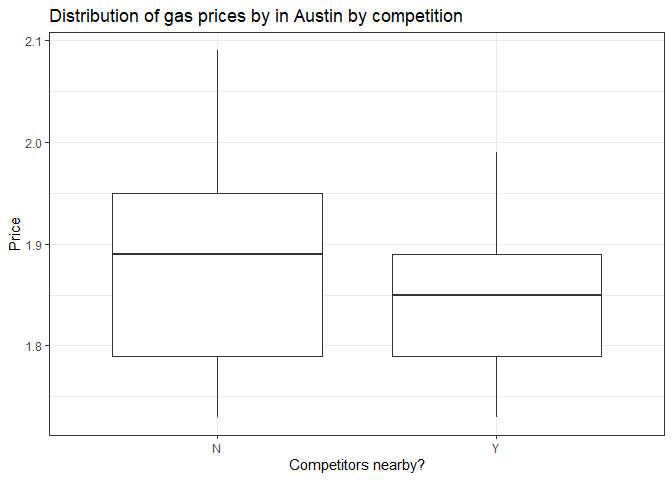

1) Data visualization: gas prices
---------------------------------

Do gas stations charge more if they lack direct competition in sight?
The graph above shows a boxplot of the distribution of gas prices by
whether there is competition in sight or not. Where “Y” represents
competition and “N” no competition. We can see that gas stations do
charge more if there is no competition as prices are more concentrated
at higher levels.

The richer the area,the higher the gas price? The graph above shows a
scatterplot of gas prices on local income in Austin. We can see a
positive relationship between the two variables.

Shell charges more than other brands? The graph above shows a barplot of
the median price by brand. From the graph, we see there is little to no
evidence of shell charging more.

Do gas stations at stoplights charge more? The graph above shows a
histogram of the gas prices in Austin by whether the gas station is at a
stoplight or not. From the graph, we see some evidence of this as the
distribution is slightly more skewed to the right for gas stations at
stoplights

Do gas stations with direct highway access charge more? The graph above
shows a boxplot of the distribution of gas prices in Austin by highway
access. Where “Y” represents highway access and “N” no highway access.
We can see that gas stations do charge more if they have direct access
to a highway as prices are more concentrated at higher levels.

2) Data visualization: a bike share network (Washington DC)
-----------------------------------------------------------

The graph above shows average ridership by hour of the day. We see that
ridership generally rises starting at 5am with peaks around 8am and 4pm
and then declines steadily for the rest of the day. This suggests that a
good chunk of ridership is driven by people taking bikes as opposed to
other means of transport during rush hour.

The graph above shows the average ridership by hour of the day and by
whether it is a working day. Similar, to the previous graph, average
ridership on workdays peaks around 8am, declines sharply and then peaks
again around 4pm. Ridership on non work days is much smoother as there
is a steady rise through the start of the day and a steady decline
through the late afternoon to evening.

The weather situation codes are as follows:

    - 1: Clear, Few clouds, Partly cloudy, Partly cloudy
    - 2: Mist + Cloudy, Mist + Broken clouds, Mist + Few clouds, Mist
    - 3: Light Snow, Light Rain + Thunderstorm + Scattered clouds, Light Rain + Scattered clouds

The graph above shows a barplot of average ridership at 8am by working
day and weather situation. We see that ridership at 8am is generally
lower on non-working days compared to work days. This suggests that a
significant number of people ride bikes to work. We also see that
average ridership declines as the weather situation worsens.

3) Data visualization: flights at ABIA
--------------------------------------

We see that the top destinations from Austin are mostly around the
mid-west. Outside of that, we see the usual popular destinations such as
Los Angeles (LAX), Atlanta (ATL), and New York (JFK)

For the purpose of my analysis, I focus on departure delays

From this, we see that the origins with the highest average delay in
minutes are heavily concentrated around the east coast and the mid-west.

We see that the average departure delays are usually in the very early
hours of the day around between 12am - 5am. Delays are usually at their
lowest in the middle of the day and this pattern is mostly consistent
across airlines.

4) K-nearest neighbors
----------------------

The Sclass350 yields a higher optimal value of K. This could possibly be
because we have more observations for the Sclass350 and so we need a
larger K to appropriately fit the model.
