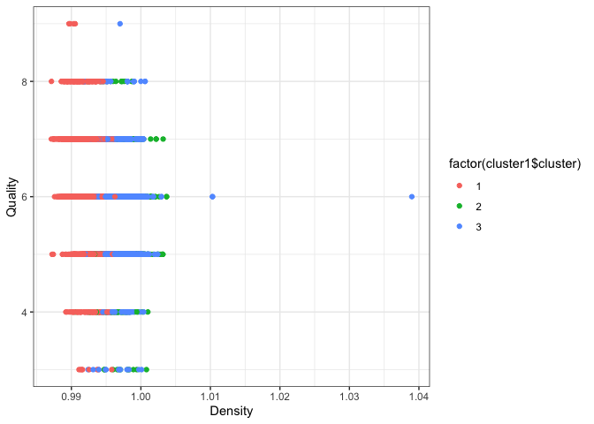
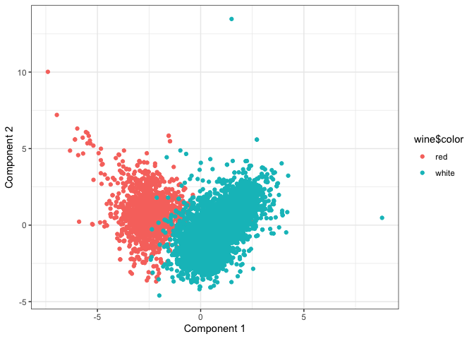
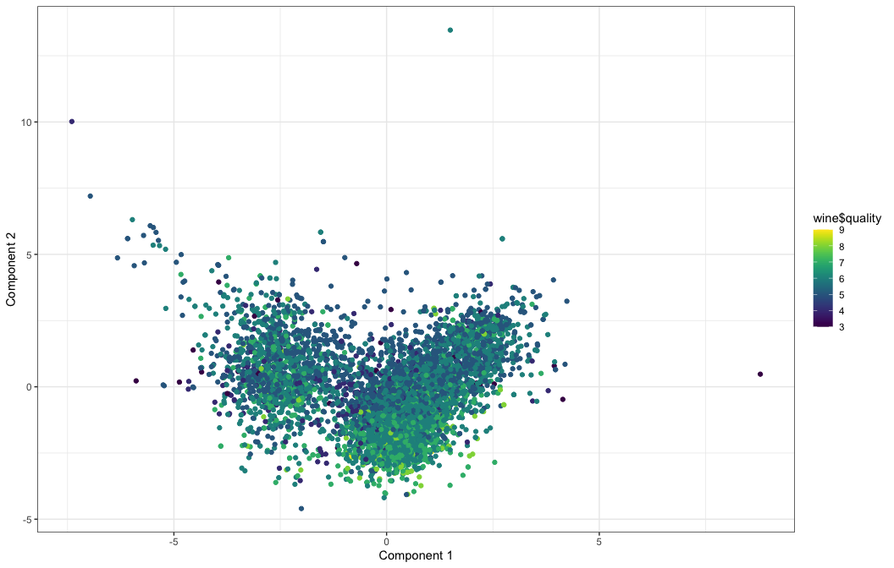
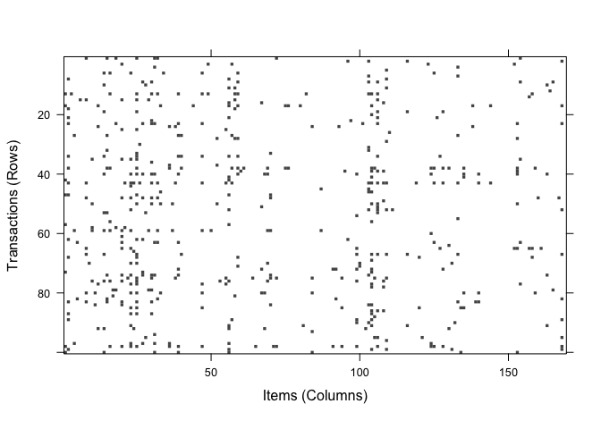
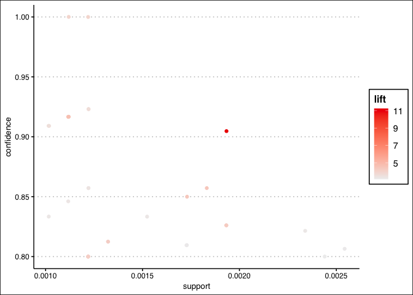
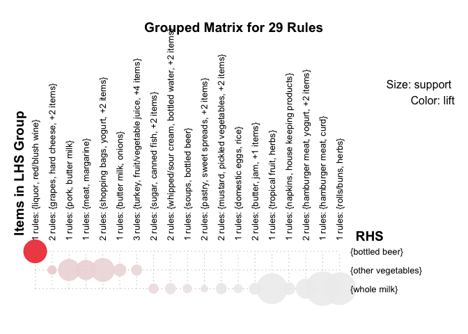
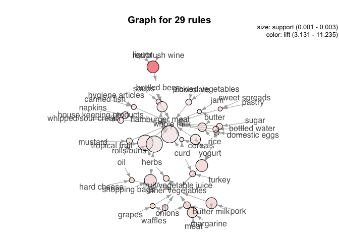
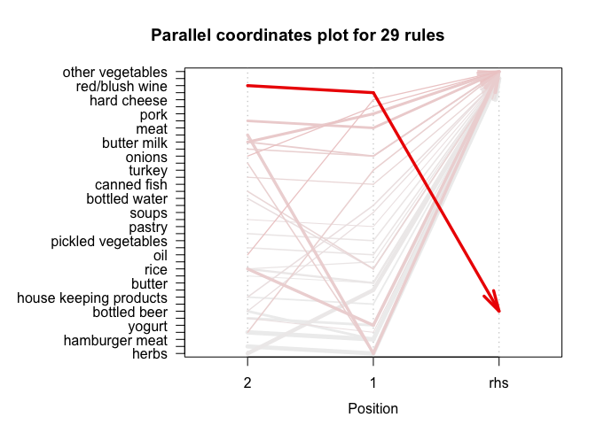

Exercise 04
================
Scott Cohn, with Olalekan Bello and Colin Wick
Last compiled on 06 May, 2021

``` r
# funcs
read_data <- function(df) {
  #' read data from git url
  #' INPUT: data set name
  #' OUTPUT: dataframe
  full_path <- paste("https://raw.githubusercontent.com/jgscott/ECO395M/master/data/", 
                     df, sep = "")
  df <- read_csv(full_path)
  return(df)
}
```

## Clustering and PCA

We use k-means clustering as our choice of clustering algorithm. We use
two clusters. The table shows the averages for the features within the
two clusters.

Cluster 1

``` r
set.seed(1234)

wine <- read_data("wine.csv")
X = wine[,-(12:13)]
X = scale(X, center = TRUE, scale=TRUE)
mu = attr(X,"scaled:center")
sigma = attr(X,"scaled:scale")


# Run k-means with 2 clusters and 50 starts
clust1 = kmeanspp(X, 2, nstart=50)

clust1$center[1,]*sigma + mu
```

    ##        fixed.acidity     volatile.acidity          citric.acid 
    ##           6.85167903           0.27458385           0.33524928 
    ##       residual.sugar            chlorides  free.sulfur.dioxide 
    ##           6.39402555           0.04510424          35.52152864 
    ## total.sulfur.dioxide              density                   pH 
    ##         138.45848785           0.99400486           3.18762464 
    ##            sulphates              alcohol 
    ##           0.48880511          10.52235888

Cluster 2

``` r
clust1$center[2,]*sigma + mu
```

    ##        fixed.acidity     volatile.acidity          citric.acid 
    ##            8.2895922            0.5319416            0.2695435 
    ##       residual.sugar            chlorides  free.sulfur.dioxide 
    ##            2.6342666            0.0883238           15.7647596 
    ## total.sulfur.dioxide              density                   pH 
    ##           48.6396835            0.9967404            3.3097200 
    ##            sulphates              alcohol 
    ##            0.6567194           10.4015216

To check whether the clustering algorithm is appropriately able to
identify the colors, we check the means for the features grouped by
color. They look very similar to the means calculated from our raw data
and it looks like cluster 1 is red wine while cluster 2 is white wine.

``` r
table1 <- 
  wine %>%
  group_by(color) %>%
  summarise(across(
    .cols = where(is.numeric), 
    .fns = list(Mean = mean), na.rm = TRUE, 
    .names = "{col}_{fn}"
    ))

pander(table1,style = "grid")
```

<table>
<caption>Table continues below</caption>
<colgroup>
<col style="width: 11%" />
<col style="width: 29%" />
<col style="width: 33%" />
<col style="width: 26%" />
</colgroup>
<thead>
<tr class="header">
<th>color</th>
<th>fixed.acidity_Mean</th>
<th>volatile.acidity_Mean</th>
<th>citric.acid_Mean</th>
</tr>
</thead>
<tbody>
<tr class="odd">
<td>red</td>
<td><pre><code>   8.32</code></pre></td>
<td><pre><code>   0.5278</code></pre></td>
<td><pre><code> 0.271</code></pre></td>
</tr>
<tr class="even">
<td>white</td>
<td><pre><code>  6.855</code></pre></td>
<td><pre><code>   0.2782</code></pre></td>
<td><pre><code> 0.3342</code></pre></td>
</tr>
</tbody>
</table>

Table continues below

<table style="width:92%;">
<caption>Table continues below</caption>
<colgroup>
<col style="width: 30%" />
<col style="width: 23%" />
<col style="width: 37%" />
</colgroup>
<thead>
<tr class="header">
<th>residual.sugar_Mean</th>
<th>chlorides_Mean</th>
<th>free.sulfur.dioxide_Mean</th>
</tr>
</thead>
<tbody>
<tr class="odd">
<td><pre><code>   2.539</code></pre></td>
<td>0.08747</td>
<td><pre><code>     15.87</code></pre></td>
</tr>
<tr class="even">
<td><pre><code>   6.391</code></pre></td>
<td>0.04577</td>
<td><pre><code>     35.31</code></pre></td>
</tr>
</tbody>
</table>

Table continues below

<table style="width:97%;">
<caption>Table continues below</caption>
<colgroup>
<col style="width: 38%" />
<col style="width: 20%" />
<col style="width: 13%" />
<col style="width: 23%" />
</colgroup>
<thead>
<tr class="header">
<th>total.sulfur.dioxide_Mean</th>
<th>density_Mean</th>
<th>pH_Mean</th>
<th>sulphates_Mean</th>
</tr>
</thead>
<tbody>
<tr class="odd">
<td><pre><code>      46.47</code></pre></td>
<td>0.9967</td>
<td>3.311</td>
<td><pre><code>0.6581</code></pre></td>
</tr>
<tr class="even">
<td><pre><code>      138.4</code></pre></td>
<td>0.994</td>
<td>3.188</td>
<td><pre><code>0.4898</code></pre></td>
</tr>
</tbody>
</table>

Table continues below

| alcohol\_Mean | quality\_Mean |
|---------------|---------------|
| 10.42         | 5.636         |
| 10.51         | 5.878         |

Let’s get a confusion matrix.

``` r
wine <- wine %>% mutate(truth= ifelse(color == "red", 2, 1))

confusion= table(truth=wine$truth, clust_pred= clust1$cluster)
acc <- round(sum(diag(confusion)/sum(confusion))*100, 2)
confusion
```

    ##      clust_pred
    ## truth    1    2
    ##     1 4830   68
    ##     2   24 1575

``` r
print(paste("Our clustering algorithm has accuracy of ", acc, "%"), quote= F)
```

    ## [1] Our clustering algorithm has accuracy of  98.58 %

Let’s now apply clustering to see if we can identify quality. Below is a
heatmap of the correlations between all the properties. We see that
quality is not particularly strongly related with any one chemical
property. Density looks to be the most negatively correlated so we’ll
use that going forward.

We use k-means clustering again. We use three clusters as we might want
to think about the quality in terms of low, high and medium.

``` r
# looks a mess -- reorder the variables by hierarchical clustering
ggcorrplot::ggcorrplot(cor(wine[, c(1:12)]), hc.order = TRUE)
```

<!-- -->

``` r
# Now run hierarchical clustering
cluster1 = kmeanspp(X, 3, nstart=50)
```

The figure below plots density and quality by cluster. We do not see any
particularly clear patterns emerge in term of quality as there looks to
be a fair mix of different quality wines in all the clusters.However, we
notice that cluster 1 could possibly have properties of high quality
wine as we see less of cluster 2 and 3 making up a smaller proportion of
the wines between the ranges of 7-9

``` r
qplot(wine$density, wine$quality, color= factor(cluster1$cluster), xlab = "Density", ylab= "Quality")+theme_bw()
```

<!-- -->

We now apply PCA and use the first two components. Figure 2 below is a
plot of the components colored by the wine color.

``` r
pc_wine = prcomp(X)
scores  = pc_wine$x
qplot(scores[,1], scores[,2], color=wine$color, xlab='Component 1', ylab='Component 2') + theme_bw()
```

<!-- --> It looks like
component 1 is able to identify the wine color pretty well. We see that
the whites are clustered more towards the right and reds are clustered
to the left.

Below is a graph of our two main principal components colored by
quality.

``` r
qplot(scores[,1], scores[,2], color= wine$quality, xlab='Component 1', ylab='Component 2') + scale_color_viridis() + theme_bw()
```

<!-- -->

We see that while it’s not particularly perfect and not as clear as the
distinction for color, the components are also able to identify quality
at some level. The higher quality wines look to be mainly around the
bottom right. Indicating that component 1 weighs positively on quality
while component 2 weighs negatively on it. To confirm, we regress
quality on components 1 and 2 and the sign of our coefficients confirm
this and we see that they are also statistically significant.

``` r
reg1 <- lm(formula = wine$quality ~ scores[, 1] + scores[, 2])
stargazer(reg1, header = F, omit.stat = c("adj.rsq", "F"), covariate.labels = c("PC1", "PC2"), type = "html")
```

<table style="text-align:center">
<tr>
<td colspan="2" style="border-bottom: 1px solid black">
</td>
</tr>
<tr>
<td style="text-align:left">
</td>
<td>
<em>Dependent variable:</em>
</td>
</tr>
<tr>
<td>
</td>
<td colspan="1" style="border-bottom: 1px solid black">
</td>
</tr>
<tr>
<td style="text-align:left">
</td>
<td>
quality
</td>
</tr>
<tr>
<td colspan="2" style="border-bottom: 1px solid black">
</td>
</tr>
<tr>
<td style="text-align:left">
PC1
</td>
<td>
0.038<sup>\*\*\*</sup>
</td>
</tr>
<tr>
<td style="text-align:left">
</td>
<td>
(0.006)
</td>
</tr>
<tr>
<td style="text-align:left">
</td>
<td>
</td>
</tr>
<tr>
<td style="text-align:left">
PC2
</td>
<td>
-0.174<sup>\*\*\*</sup>
</td>
</tr>
<tr>
<td style="text-align:left">
</td>
<td>
(0.006)
</td>
</tr>
<tr>
<td style="text-align:left">
</td>
<td>
</td>
</tr>
<tr>
<td style="text-align:left">
Constant
</td>
<td>
5.818<sup>\*\*\*</sup>
</td>
</tr>
<tr>
<td style="text-align:left">
</td>
<td>
(0.010)
</td>
</tr>
<tr>
<td style="text-align:left">
</td>
<td>
</td>
</tr>
<tr>
<td colspan="2" style="border-bottom: 1px solid black">
</td>
</tr>
<tr>
<td style="text-align:left">
Observations
</td>
<td>
6,497
</td>
</tr>
<tr>
<td style="text-align:left">
R<sup>2</sup>
</td>
<td>
0.105
</td>
</tr>
<tr>
<td style="text-align:left">
Residual Std. Error
</td>
<td>
0.826 (df = 6494)
</td>
</tr>
<tr>
<td colspan="2" style="border-bottom: 1px solid black">
</td>
</tr>
<tr>
<td style="text-align:left">
<em>Note:</em>
</td>
<td style="text-align:right">
<sup>*</sup>p&lt;0.1; <sup>**</sup>p&lt;0.05; <sup>***</sup>p&lt;0.01
</td>
</tr>
</table>

## Market Segmentation

## Association Rules for Grocery Purchases

First we load the data.

``` r
data("Groceries")
```

We can examine the sparse matrix of transactions and items in a simple
plot.

``` r
image(sample(Groceries, 100))
```

<!-- -->

``` r
dev.off() 
```

    ## null device 
    ##           1

What are the most frequent item purchases?

``` r
frequent_items <- eclat(Groceries, parameter = list(supp = 0.07, maxlen = 15)) 
```

    ## Eclat
    ## 
    ## parameter specification:
    ##  tidLists support minlen maxlen            target  ext
    ##     FALSE    0.07      1     15 frequent itemsets TRUE
    ## 
    ## algorithmic control:
    ##  sparse sort verbose
    ##       7   -2    TRUE
    ## 
    ## Absolute minimum support count: 688 
    ## 
    ## create itemset ... 
    ## set transactions ...[169 item(s), 9835 transaction(s)] done [0.00s].
    ## sorting and recoding items ... [18 item(s)] done [0.00s].
    ## creating sparse bit matrix ... [18 row(s), 9835 column(s)] done [0.00s].
    ## writing  ... [19 set(s)] done [0.00s].
    ## Creating S4 object  ... done [0.00s].

``` r
summary(frequent_items)
```

    ## set of 19 itemsets
    ## 
    ## most frequent items:
    ## other vegetables       whole milk          sausage     citrus fruit 
    ##                2                2                1                1 
    ##   tropical fruit          (Other) 
    ##                1               13 
    ## 
    ## element (itemset/transaction) length distribution:sizes
    ##  1  2 
    ## 18  1 
    ## 
    ##    Min. 1st Qu.  Median    Mean 3rd Qu.    Max. 
    ##   1.000   1.000   1.000   1.053   1.000   2.000 
    ## 
    ## summary of quality measures:
    ##     support        transIdenticalToItemsets     count       
    ##  Min.   :0.07168   Min.   : 705.0           Min.   : 705.0  
    ##  1st Qu.:0.07875   1st Qu.: 774.5           1st Qu.: 774.5  
    ##  Median :0.09395   Median : 924.0           Median : 924.0  
    ##  Mean   :0.11410   Mean   :1122.2           Mean   :1122.2  
    ##  3rd Qu.:0.12501   3rd Qu.:1229.5           3rd Qu.:1229.5  
    ##  Max.   :0.25552   Max.   :2513.0           Max.   :2513.0  
    ## 
    ## includes transaction ID lists: FALSE 
    ## 
    ## mining info:
    ##       data ntransactions support
    ##  Groceries          9835    0.07

Next, we use the `apriori` function, which implements the Apriori
algorithm to mine frequent itemsets, to define rules for purchasing
associations.

``` r
rules <- apriori(Groceries, parameter = list(supp = 0.001, conf = 0.8, maxlen = 3)) # Min Support as 0.001, confidence as 0.8.
```

    ## Apriori
    ## 
    ## Parameter specification:
    ##  confidence minval smax arem  aval originalSupport maxtime support minlen
    ##         0.8    0.1    1 none FALSE            TRUE       5   0.001      1
    ##  maxlen target  ext
    ##       3  rules TRUE
    ## 
    ## Algorithmic control:
    ##  filter tree heap memopt load sort verbose
    ##     0.1 TRUE TRUE  FALSE TRUE    2    TRUE
    ## 
    ## Absolute minimum support count: 9 
    ## 
    ## set item appearances ...[0 item(s)] done [0.00s].
    ## set transactions ...[169 item(s), 9835 transaction(s)] done [0.01s].
    ## sorting and recoding items ... [157 item(s)] done [0.00s].
    ## creating transaction tree ... done [0.00s].
    ## checking subsets of size 1 2 3 done [0.01s].
    ## writing ... [29 rule(s)] done [0.00s].
    ## creating S4 object  ... done [0.00s].

``` r
# remove redundant rules (not needed)
# subset_matrix <- is.subset(rules, rules)
# subset_matrix[lower.tri(subset_matrix, diag = T)] <- NA # not working
# redundant <- colSums(subset_matrix, na.rm = T) >= 1
# rules_pruned <- rules[!redundant]
# rules <- rules_pruned

summary(rules)
```

    ## set of 29 rules
    ## 
    ## rule length distribution (lhs + rhs):sizes
    ##  3 
    ## 29 
    ## 
    ##    Min. 1st Qu.  Median    Mean 3rd Qu.    Max. 
    ##       3       3       3       3       3       3 
    ## 
    ## summary of quality measures:
    ##     support           confidence        coverage             lift       
    ##  Min.   :0.001017   Min.   :0.8000   Min.   :0.001118   Min.   : 3.131  
    ##  1st Qu.:0.001118   1st Qu.:0.8125   1st Qu.:0.001220   1st Qu.: 3.261  
    ##  Median :0.001220   Median :0.8462   Median :0.001525   Median : 3.613  
    ##  Mean   :0.001473   Mean   :0.8613   Mean   :0.001732   Mean   : 4.000  
    ##  3rd Qu.:0.001729   3rd Qu.:0.9091   3rd Qu.:0.002135   3rd Qu.: 4.199  
    ##  Max.   :0.002542   Max.   :1.0000   Max.   :0.003152   Max.   :11.235  
    ##      count      
    ##  Min.   :10.00  
    ##  1st Qu.:11.00  
    ##  Median :12.00  
    ##  Mean   :14.48  
    ##  3rd Qu.:17.00  
    ##  Max.   :25.00  
    ## 
    ## mining info:
    ##       data ntransactions support confidence
    ##  Groceries          9835   0.001        0.8

Some of the rules can be visualized.

``` r
plot(rules, engine = "ggplot") + theme_clean()
```

<!-- -->

``` r
plot(rules, "scatterplot", engine = "ggplot") + theme_clean()
```

<!-- -->

``` r
plot(rules, "grouped", engine = "default") 
```

<!-- -->

``` r
head(quality(rules)) %>% kbl(digits = 4, "pipe")
```

| support | confidence | coverage |    lift | count |
|--------:|-----------:|---------:|--------:|------:|
|  0.0019 |     0.9048 |   0.0021 | 11.2353 |    19 |
|  0.0010 |     0.9091 |   0.0011 |  3.5579 |    10 |
|  0.0017 |     0.8095 |   0.0021 |  3.1682 |    17 |
|  0.0010 |     0.8333 |   0.0012 |  3.2614 |    10 |
|  0.0011 |     0.9167 |   0.0012 |  3.5875 |    11 |
|  0.0013 |     0.8125 |   0.0016 |  3.1798 |    13 |

``` r
arules::itemFrequencyPlot(
  Groceries,
  topN = 15,
  col = 'dodgerblue',
  main = 'Relative Item Frequency Plot',
  type = "relative",
  ylab = "Item Frequency"
  )
```

<!-- -->

``` r
plot(rules, method = "graph", control = list(type = "items"), engine = "igraph")
```

    ## Available control parameters (with default values):
    ## main  =  Graph for 29 rules
    ## max   =  100
    ## nodeCol   =  c("#EE0000FF", "#EE0303FF", "#EE0606FF", "#EE0909FF", "#EE0C0CFF", "#EE0F0FFF", "#EE1212FF", "#EE1515FF", "#EE1818FF", "#EE1B1BFF", "#EE1E1EFF", "#EE2222FF", "#EE2525FF", "#EE2828FF", "#EE2B2BFF", "#EE2E2EFF", "#EE3131FF", "#EE3434FF", "#EE3737FF", "#EE3A3AFF", "#EE3D3DFF", "#EE4040FF", "#EE4444FF", "#EE4747FF", "#EE4A4AFF", "#EE4D4DFF", "#EE5050FF", "#EE5353FF", "#EE5656FF", "#EE5959FF", "#EE5C5CFF", "#EE5F5FFF", "#EE6262FF", "#EE6666FF", "#EE6969FF", "#EE6C6CFF", "#EE6F6FFF", "#EE7272FF", "#EE7575FF",  "#EE7878FF", "#EE7B7BFF", "#EE7E7EFF", "#EE8181FF", "#EE8484FF", "#EE8888FF", "#EE8B8BFF", "#EE8E8EFF", "#EE9191FF", "#EE9494FF", "#EE9797FF", "#EE9999FF", "#EE9B9BFF", "#EE9D9DFF", "#EE9F9FFF", "#EEA0A0FF", "#EEA2A2FF", "#EEA4A4FF", "#EEA5A5FF", "#EEA7A7FF", "#EEA9A9FF", "#EEABABFF", "#EEACACFF", "#EEAEAEFF", "#EEB0B0FF", "#EEB1B1FF", "#EEB3B3FF", "#EEB5B5FF", "#EEB7B7FF", "#EEB8B8FF", "#EEBABAFF", "#EEBCBCFF", "#EEBDBDFF", "#EEBFBFFF", "#EEC1C1FF", "#EEC3C3FF", "#EEC4C4FF", "#EEC6C6FF", "#EEC8C8FF",  "#EEC9C9FF", "#EECBCBFF", "#EECDCDFF", "#EECFCFFF", "#EED0D0FF", "#EED2D2FF", "#EED4D4FF", "#EED5D5FF", "#EED7D7FF", "#EED9D9FF", "#EEDBDBFF", "#EEDCDCFF", "#EEDEDEFF", "#EEE0E0FF", "#EEE1E1FF", "#EEE3E3FF", "#EEE5E5FF", "#EEE7E7FF", "#EEE8E8FF", "#EEEAEAFF", "#EEECECFF", "#EEEEEEFF")
    ## itemnodeCol   =  #66CC66FF
    ## edgeCol   =  #ABABABFF
    ## labelCol  =  #000000B3
    ## itemLabels    =  TRUE
    ## measureLabels     =  FALSE
    ## precision     =  3
    ## arrowSize     =  0.5
    ## alpha     =  0.5
    ## cex   =  1
    ## layout    =  NULL
    ## layoutParams  =  list()
    ## engine    =  igraph
    ## plot  =  TRUE
    ## plot_options  =  list()
    ## verbose   =  FALSE

<!-- -->

``` r
plot(rules, method = "paracoord", control = list(type = "items"))
```

    ## Available control parameters (with default values):
    ## main  =  Parallel coordinates plot for 29 rules
    ## reorder   =  FALSE
    ## interactive   =  FALSE
    ## engine    =  default
    ## gp_labels     =  list()
    ## newpage   =  TRUE
    ## col   =  c("#EE0000FF", "#EE0303FF", "#EE0606FF", "#EE0909FF", "#EE0C0CFF", "#EE0F0FFF", "#EE1212FF", "#EE1515FF", "#EE1818FF", "#EE1B1BFF", "#EE1E1EFF", "#EE2222FF", "#EE2525FF", "#EE2828FF", "#EE2B2BFF", "#EE2E2EFF", "#EE3131FF", "#EE3434FF", "#EE3737FF", "#EE3A3AFF", "#EE3D3DFF", "#EE4040FF", "#EE4444FF", "#EE4747FF", "#EE4A4AFF", "#EE4D4DFF", "#EE5050FF", "#EE5353FF", "#EE5656FF", "#EE5959FF", "#EE5C5CFF", "#EE5F5FFF", "#EE6262FF", "#EE6666FF", "#EE6969FF", "#EE6C6CFF", "#EE6F6FFF", "#EE7272FF", "#EE7575FF",  "#EE7878FF", "#EE7B7BFF", "#EE7E7EFF", "#EE8181FF", "#EE8484FF", "#EE8888FF", "#EE8B8BFF", "#EE8E8EFF", "#EE9191FF", "#EE9494FF", "#EE9797FF", "#EE9999FF", "#EE9B9BFF", "#EE9D9DFF", "#EE9F9FFF", "#EEA0A0FF", "#EEA2A2FF", "#EEA4A4FF", "#EEA5A5FF", "#EEA7A7FF", "#EEA9A9FF", "#EEABABFF", "#EEACACFF", "#EEAEAEFF", "#EEB0B0FF", "#EEB1B1FF", "#EEB3B3FF", "#EEB5B5FF", "#EEB7B7FF", "#EEB8B8FF", "#EEBABAFF", "#EEBCBCFF", "#EEBDBDFF", "#EEBFBFFF", "#EEC1C1FF", "#EEC3C3FF", "#EEC4C4FF", "#EEC6C6FF", "#EEC8C8FF",  "#EEC9C9FF", "#EECBCBFF", "#EECDCDFF", "#EECFCFFF", "#EED0D0FF", "#EED2D2FF", "#EED4D4FF", "#EED5D5FF", "#EED7D7FF", "#EED9D9FF", "#EEDBDBFF", "#EEDCDCFF", "#EEDEDEFF", "#EEE0E0FF", "#EEE1E1FF", "#EEE3E3FF", "#EEE5E5FF", "#EEE7E7FF", "#EEE8E8FF", "#EEEAEAFF", "#EEECECFF", "#EEEEEEFF")
    ## alpha     =  NULL
    ## quality   =  2
    ## verbose   =  FALSE

<!-- -->

From the visualizations and the summaries of item pairs, I recommend the
following aisles:

1.  Groceries Aisle – Milk, Eggs and Vegetables
2.  Liquor Aisle – Liquor, Red/Blush Wine, Bottled Beer, Soda
3.  Eateries Aisle – Herbs, Tropical Fruits, Rolls/Buns, Fruit Juices,
    Jams
4.  Breakfast Aisle – Cereals, Yogurt, Rice, Curd

## Author Attribution

First, we load the data.

``` r
## Collect data

# training data
Data_train <- readtext(Sys.glob('../../ECO395M/data/ReutersC50/C50train/*'))
# head(Data_train$text, n = 1)

# testing data
Data_test <- readtext(Sys.glob('../../ECO395M/data/ReutersC50/C50test/*'))
```

Then we pull author names from the file directory and assign them to
texts, and do a check to make sure it worked as expected.

``` r
# author names
author_names <- as.data.frame(rep(basename(list.dirs('../../ECO395M/data/ReutersC50/C50train')), each = 50))
author_names <- author_names[-(1:50),]

# assign author name to Text
Data_test$author <- author_names
Data_train$author <- author_names

# dropping ID column
Data_test <- Data_test[-1]
Data_train <- Data_train[-1]

# converting author column to factor
Data_test$author <- as.factor(Data_test$author)
Data_train$author <- as.factor(Data_train$author)

# did it work?
table(Data_train$author) %>% kbl("pipe")
```

| Var1              | Freq |
|:------------------|-----:|
| AaronPressman     |   50 |
| AlanCrosby        |   50 |
| AlexanderSmith    |   50 |
| BenjaminKangLim   |   50 |
| BernardHickey     |   50 |
| BradDorfman       |   50 |
| DarrenSchuettler  |   50 |
| DavidLawder       |   50 |
| EdnaFernandes     |   50 |
| EricAuchard       |   50 |
| FumikoFujisaki    |   50 |
| GrahamEarnshaw    |   50 |
| HeatherScoffield  |   50 |
| JaneMacartney     |   50 |
| JanLopatka        |   50 |
| JimGilchrist      |   50 |
| JoeOrtiz          |   50 |
| JohnMastrini      |   50 |
| JonathanBirt      |   50 |
| JoWinterbottom    |   50 |
| KarlPenhaul       |   50 |
| KeithWeir         |   50 |
| KevinDrawbaugh    |   50 |
| KevinMorrison     |   50 |
| KirstinRidley     |   50 |
| KouroshKarimkhany |   50 |
| LydiaZajc         |   50 |
| LynneO’Donnell    |   50 |
| LynnleyBrowning   |   50 |
| MarcelMichelson   |   50 |
| MarkBendeich      |   50 |
| MartinWolk        |   50 |
| MatthewBunce      |   50 |
| MichaelConnor     |   50 |
| MureDickie        |   50 |
| NickLouth         |   50 |
| PatriciaCommins   |   50 |
| PeterHumphrey     |   50 |
| PierreTran        |   50 |
| RobinSidel        |   50 |
| RogerFillion      |   50 |
| SamuelPerry       |   50 |
| SarahDavison      |   50 |
| ScottHillis       |   50 |
| SimonCowell       |   50 |
| TanEeLyn          |   50 |
| TheresePoletti    |   50 |
| TimFarrand        |   50 |
| ToddNissen        |   50 |
| WilliamKazer      |   50 |

Next, we create the corpus. This is split into a train/test and are
stripped of punctuation, forced to lowercase, and numbers are removed —
as well as whitespace and common stopwords. I use simple wordclouds to
check if this process is working as expected.

``` r
## Explore and Prep

# Create corpus
test_corpus <- Corpus(VectorSource(Data_test$text))
train_corpus <- Corpus(VectorSource(Data_train$text))

# clean corpus
test_corpus <-
  test_corpus %>%
  tm_map(., content_transformer(tolower)) %>%
  tm_map(., content_transformer(removeNumbers)) %>%
  tm_map(., content_transformer(removePunctuation)) %>%
  tm_map(., content_transformer(stripWhitespace)) %>%
  tm_map(., content_transformer(removeWords), stopwords("SMART"))

# did it work?
# inspect(test_corpus[1])
wordcloud(test_corpus, min.freq = 40, random.order = FALSE)
```

<!-- -->

``` r
train_corpus <-
  train_corpus %>%
  tm_map(., content_transformer(tolower)) %>%
  tm_map(., content_transformer(removeNumbers)) %>%
  tm_map(., content_transformer(removePunctuation)) %>%
  tm_map(., content_transformer(stripWhitespace)) %>%
  tm_map(., content_transformer(removeWords), stopwords("SMART"))
```

To analyze the text, I create document-term matrices from the corpuses.

``` r
# document term matrix (sparse matrices)
test_dtm <- DocumentTermMatrix(test_corpus)
train_dtm <- DocumentTermMatrix(train_corpus)

# inspect(train_dtm)
```

Finally, with the document-term matrices, I use a naive-bayes classifier
to predict the author of the text using a dictionary of words unique to
each article.

``` r
## Naive Bayes Classification
freq_words <- findFreqTerms(train_dtm, 5)

# saving List using Dictionary() Function
Dictionary <- function(x) {
  if (is.character(x)) {
    return(x)
  }
  stop('x is not a character vector')
}

data_dict <- Dictionary(findFreqTerms(train_dtm, 5))

# appending Document Term Matrix to Train and Test Dataset 
data_train <- DocumentTermMatrix(train_corpus, list(data_dict))
data_test <- DocumentTermMatrix(test_corpus, list(data_dict))

# converting the frequency of word to count
convert_counts <- function(x) {
  x <- ifelse(x > 0, 1, 0)
  x <- factor(x, levels = c(0, 1), labels = c("No", "Yes")) 
  return(x)
}

# appending count function to Train and Test Dataset
data_train <- apply(data_train, MARGIN = 2, convert_counts)
data_test <- apply(data_test, MARGIN = 2, convert_counts)

# train model
data_classifier <- naiveBayes(data_train, Data_train$author)

data_test_pred <- predict(data_classifier, data_test)
# CrossTable(data_test_pred, Data_test$author,
#            prop.chisq = FALSE, prop.t = FALSE,
#            dnn = c('predicted', 'actual'))
```

I apply the trained model to the test set and compare the “actual
author” to the predicted author.

``` r
final_df <- 
  tibble(
    "predicted" = data_test_pred,
    "actual" = Data_test$author
  )

num_correct <- 
  final_df %>% 
  mutate(correct = if_else(predicted == actual, 1, 0)) %>%
  pull(correct) %>%
  sum()

num_rows <- final_df %>% nrow()

num_correct / num_rows
```

    ## [1] 0.6724

This model guesses correctly (out of 50 authors) 70% of the time.

## Session Information

``` r
sessionInfo()
```

    ## R version 4.0.3 (2020-10-10)
    ## Platform: x86_64-apple-darwin17.0 (64-bit)
    ## Running under: macOS Big Sur 10.16
    ## 
    ## Matrix products: default
    ## BLAS:   /Library/Frameworks/R.framework/Versions/4.0/Resources/lib/libRblas.dylib
    ## LAPACK: /Library/Frameworks/R.framework/Versions/4.0/Resources/lib/libRlapack.dylib
    ## 
    ## locale:
    ## [1] en_US.UTF-8/en_US.UTF-8/en_US.UTF-8/C/en_US.UTF-8/en_US.UTF-8
    ## 
    ## attached base packages:
    ## [1] stats     graphics  grDevices utils     datasets  methods   base     
    ## 
    ## other attached packages:
    ##  [1] SnowballC_0.7.0    tm_0.7-7           NLP_0.2-1          arulesViz_1.4-0   
    ##  [5] arules_1.6-7       Matrix_1.2-18      patchwork_1.1.1    yardstick_0.0.7   
    ##  [9] workflows_0.2.1    tune_0.1.2         rsample_0.0.8      recipes_0.1.15    
    ## [13] parsnip_0.1.5      modeldata_0.1.0    infer_0.5.4        dials_0.0.9       
    ## [17] scales_1.1.1       broom_0.7.3        tidymodels_0.1.2   janitor_2.1.0     
    ## [21] estimatr_0.26.0    skimr_2.1.2        modelsummary_0.6.1 kableExtra_1.2.1  
    ## [25] tictoc_1.0         ggthemes_4.2.0     forcats_0.5.0      stringr_1.4.0     
    ## [29] dplyr_1.0.2        purrr_0.3.4        readr_1.3.1        tidyr_1.1.2       
    ## [33] tibble_3.0.5       ggplot2_3.3.3      tidyverse_1.3.0   
    ## 
    ## loaded via a namespace (and not attached):
    ##   [1] readxl_1.3.1       backports_1.1.6    tidytext_0.2.5    
    ##   [4] plyr_1.8.6         repr_1.1.0         splines_4.0.3     
    ##   [7] listenv_0.8.0      TH.data_1.0-10     digest_0.6.27     
    ##  [10] foreach_1.5.0      htmltools_0.4.0    fansi_0.4.1       
    ##  [13] magrittr_2.0.1     globals_0.14.0     modelr_0.1.7      
    ##  [16] gower_0.2.2        wordcloud_2.6      sandwich_3.0-0    
    ##  [19] colorspace_1.4-1   blob_1.2.1         rvest_0.3.6       
    ##  [22] haven_2.2.0        xfun_0.21          crayon_1.3.4      
    ##  [25] jsonlite_1.7.1     survival_3.2-7     zoo_1.8-8         
    ##  [28] iterators_1.0.12   glue_1.4.2         registry_0.5-1    
    ##  [31] gtable_0.3.0       ipred_0.9-9        emmeans_1.4.7     
    ##  [34] webshot_0.5.2      mvtnorm_1.1-1      DBI_1.1.0         
    ##  [37] Rcpp_1.0.4.6       viridisLite_0.3.0  xtable_1.8-4      
    ##  [40] GPfit_1.0-8        statquotes_0.2.2   Formula_1.2-3     
    ##  [43] lava_1.6.8.1       prodlim_2019.11.13 httr_1.4.2        
    ##  [46] RColorBrewer_1.1-2 ellipsis_0.3.1     pkgconfig_2.0.3   
    ##  [49] farver_2.0.3       nnet_7.3-14        dbplyr_1.4.4      
    ##  [52] labeling_0.3       tidyselect_1.1.0   rlang_0.4.10      
    ##  [55] DiceDesign_1.8-1   munsell_0.5.0      cellranger_1.1.0  
    ##  [58] tools_4.0.3        cli_2.2.0          generics_0.1.0    
    ##  [61] evaluate_0.14      yaml_2.2.1         tables_0.9.4      
    ##  [64] knitr_1.30         fs_1.5.0           future_1.21.0     
    ##  [67] slam_0.1-47        xml2_1.3.2         tokenizers_0.2.1  
    ##  [70] compiler_4.0.3     rstudioapi_0.13    reprex_0.3.0      
    ##  [73] lhs_1.1.1          stringi_1.5.3      lattice_0.20-41   
    ##  [76] vctrs_0.3.4        pillar_1.4.4       lifecycle_0.2.0   
    ##  [79] furrr_0.2.1        estimability_1.3   seriation_1.2-9   
    ##  [82] R6_2.4.1           TSP_1.1-10         janeaustenr_0.1.5 
    ##  [85] parallelly_1.23.0  codetools_0.2-16   MASS_7.3-53       
    ##  [88] assertthat_0.2.1   withr_2.2.0        multcomp_1.4-14   
    ##  [91] parallel_4.0.3     hms_0.5.3          grid_4.0.3        
    ##  [94] rpart_4.1-15       timeDate_3043.102  class_7.3-17      
    ##  [97] rmarkdown_2.5      snakecase_0.11.0   pROC_1.17.0.1     
    ## [100] lubridate_1.7.8    base64enc_0.1-3
